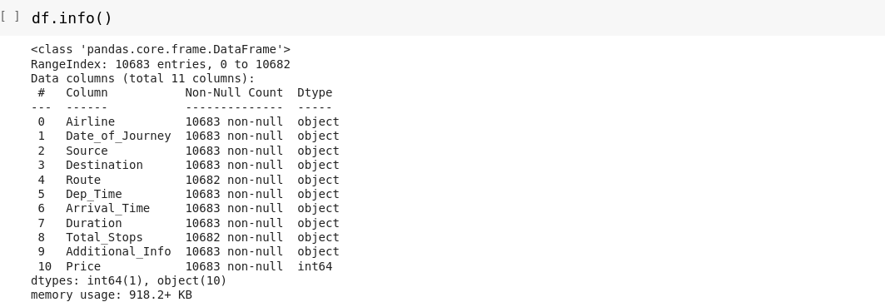

# workshop-Multivariate-analysis
## AIM:
To perform multivarient analysis on the given data set.

## ALGORITHM:
### STEP1
1.Clean the data

### STEP2
2.Remove outliers

### STEP3
3.Apply the skew function and Kurtosis

### STEP4
4.Apply Bivariate analysis on numerical and categorical

### STEP5
5.Apply Multivariate analysis

## CODE:
```
import pandas as pd
import seaborn as sns
import matplotlib as plt
df=pd.read_csv("/content/FlightInformation.csv")
```
DETECTING NULL AS PD:


INFO:


REMOVING NULL DATA:


KURTOSIS:


SKEW:


NUMERICAL & NUMERICAL:


NUMERICAL & CATEGORIAL:
BAR PLOT:


DIST PLOT:


MULTIVARIENT ANALYSIS:

CORRELATION:


HEAT MAP:
```
import numpy as np
import seaborn as sn
import matplotlib.pyplot as plt
data= pd.read_csv("/content/FlightInformation.csv")
data = np.random.randint(low = 1, high = 100, size = (10, 10))
print("The data to be plotted:\n")
print(data)
hm = sn.heatmap(data = data)
plt.show()
```


Result :
Thus we applied Bivariate/Multivariate Analysis Successfully.